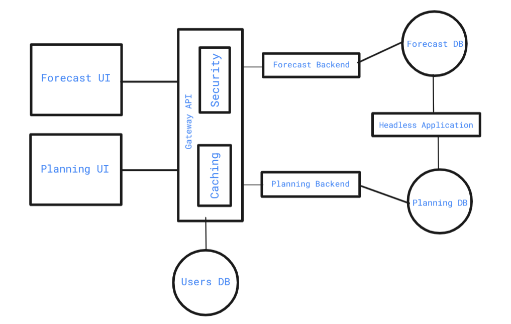
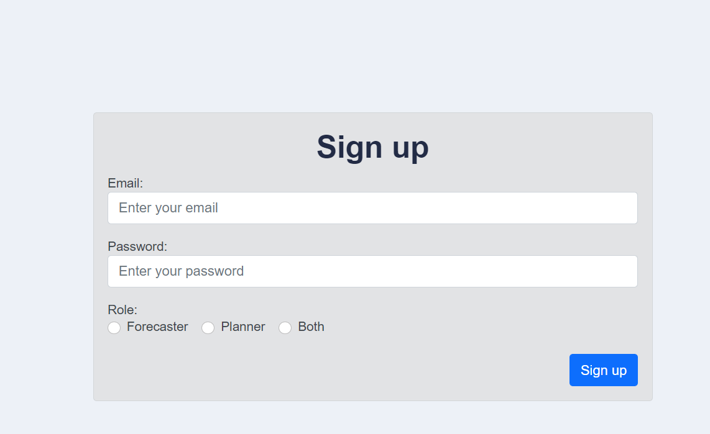
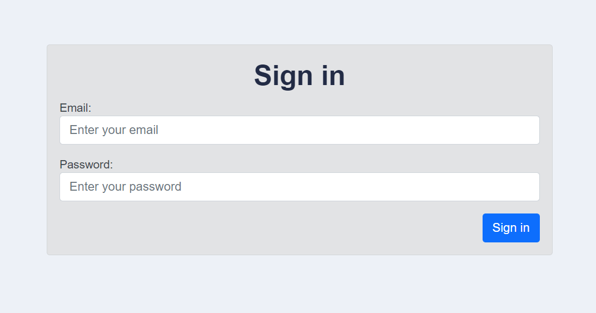
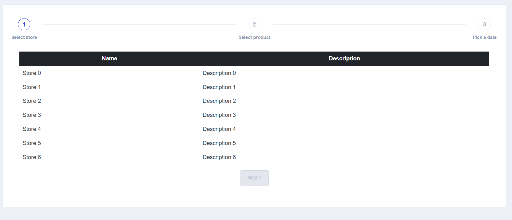
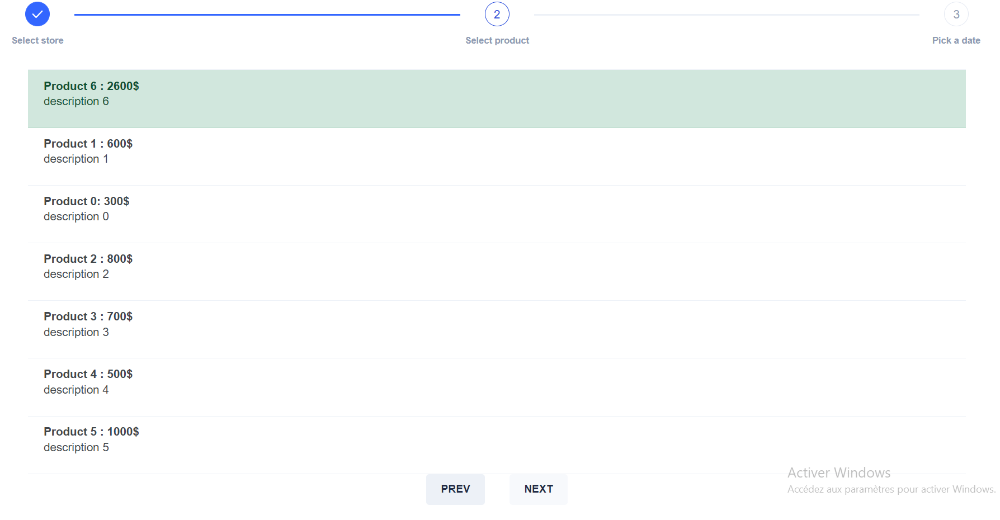
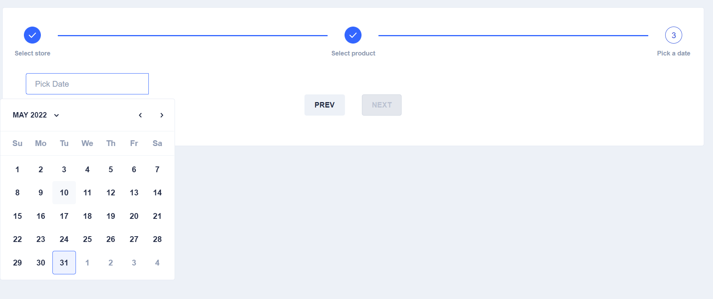
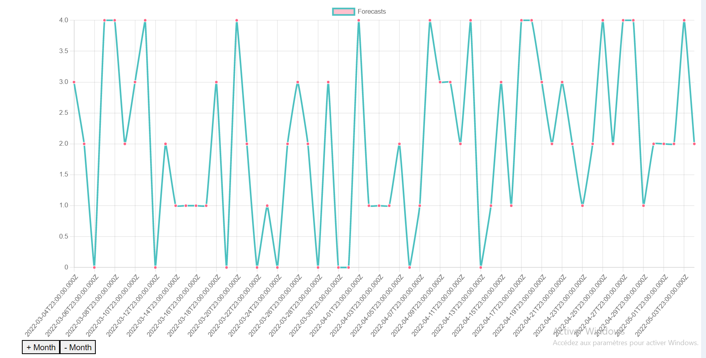

# Architecture  

---

in this lab we implemented these modules:
- Gateway API:  
    - caches the data to increase performance  
    - security through RBA (Role Based Access) => we have two roles (Forcaster / Planner)
    - entry point and standardized process for interactions between the user and business logic.  
- Forecast Backend:  
    - forecast the number of sales of a particular product within a 1 year between the date selected by the user (before and after 6 month of that date)
- Forecast Database Design:  
`Product: id, name, price, description`  
`Store: id, name, description`  
`Forecast: id, product, store, numberOfSales`  
- User Database Design:  
`User: id, name, email, password, role`  
`Role is an enumeration (Forcaster, Planner)`  

# Running the application

---
To run the application first you need to create two postgresql databases:  
    - forecast-stores
    - forecast-users

cd forecast-backend; npm run start
cd gateway-api; npm run start
cd forecastUI; ng serve -o

if we are authenticated as forcaster we will get this view  

We choose the store and we will get the list of products in that store

We then choose the product, next we will be asked to enter the date of the forecast

now a forecast is generated and we will get a chart of the forecasts of 1 year centered by the date we selected (before and after)
to have a clear chart we chose to have two buttons to navigate through the chart that adds and subtracts one month

